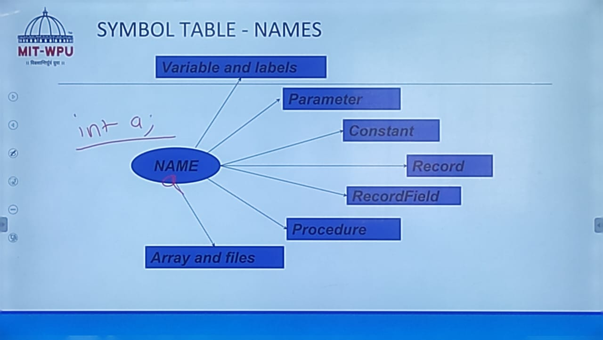
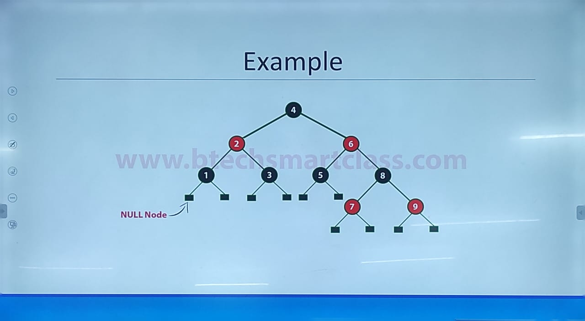
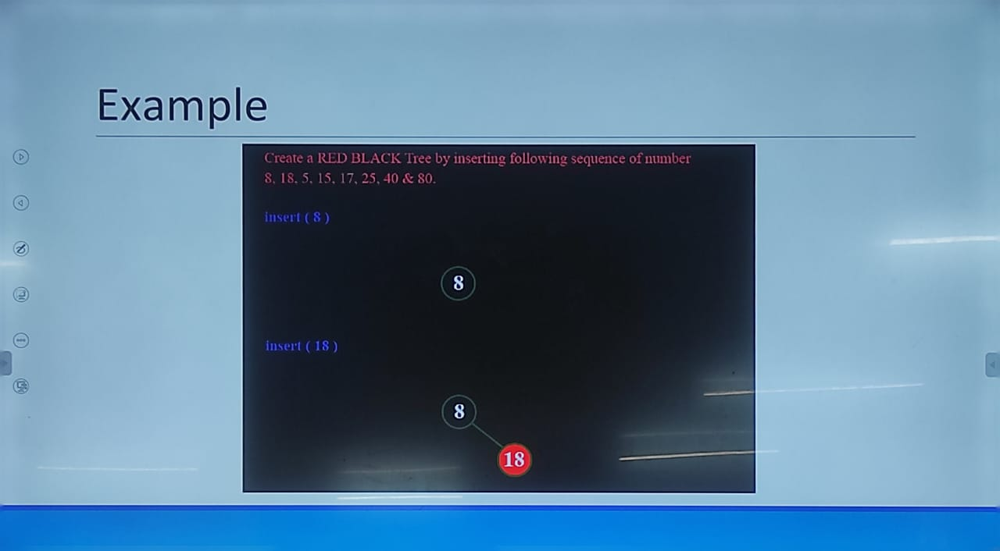
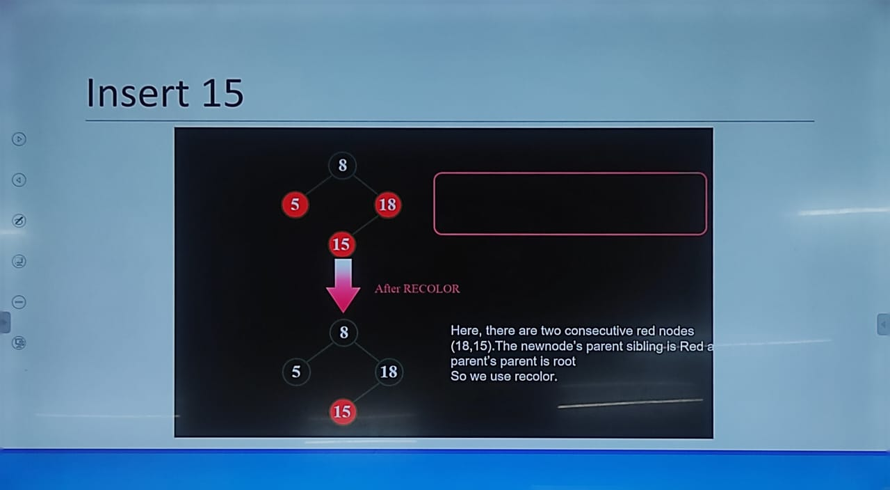
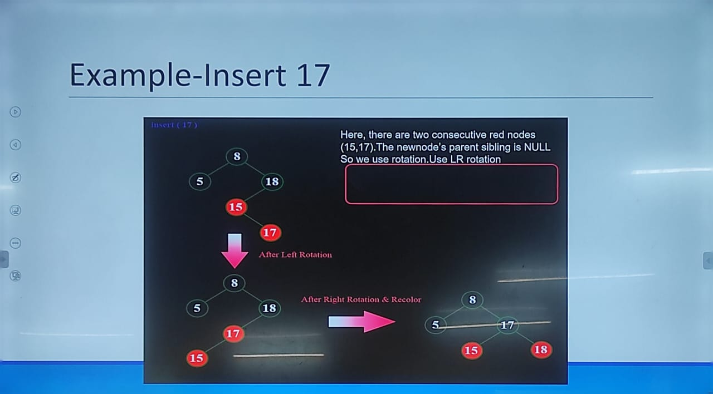
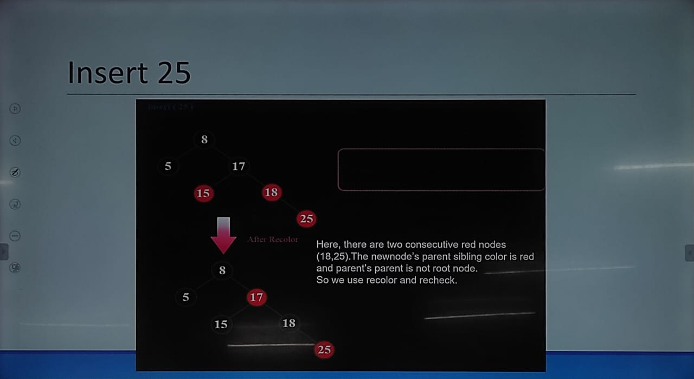
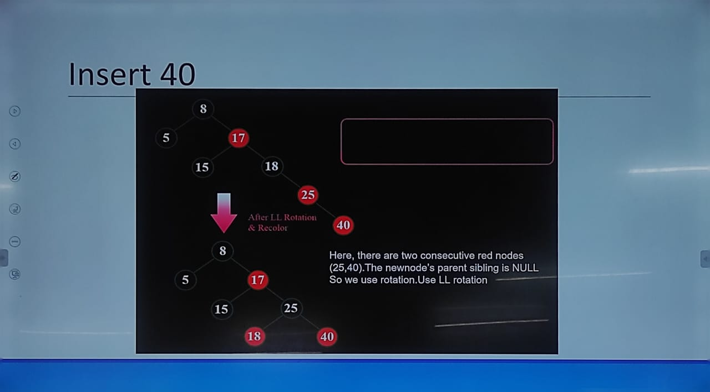

# Unit-3 #

## Symbol Table ##

- Symbol table is defined as a neme-value pair.
- Symbol tables are data structures that are used by compilers to hold information about source program variables.

Associates attributes with identifiers used in a program

- for instance, a type attribute is usually associated with each identifier.
- A symbol table is a necessory component of a compiler.
- When identifiers are found, they will be entered into aa symbol table, which will hold all relevalnt information about indentifiers.
- This information will be used later by the semnatic analyzer and the code generator.

## Possible Implementations ##

Unordered list: for a very small set of variables.

- Simplest to iplement.
- Implemented as an array or a likned list.
- Linked List can grow dynamically - alleviates problem of running out of space.
- Insertion is fast O(1), but lookup is slow O(n).

Ordered linear list:

- if an array is sorted, it can be serached using binary search - O(log2n)
- insertion into a sorted array is slow O(n)
- lookup is fast O(log2n)

BInary serach tree:

- can grow dynamically - alleviates problem of running out of space.
- insertion and lookup are fast O(log2n)

## Representaion of Symbol Table ##

There are 2 diffrent ways:

1. Static Tree Tables
2. Dynamic Tree Tables

## Optimal Binary Search Tree ##

- To optimize a tbale knowing what keys are in the table and what the probable distribution is of thse that are not in the table, we build an optimal binary search tree (OSBT).
- Optimal binary search tree is a binary search tree having an average search time of all keys optimal.
- An OBST is a BST with minimum cost.

A full binary tree may not ne a optimal binary search tree if the identifiers are searched for with diffrent frequency.

Consider these towe serach trees, if we search for each identifier with equal probability
In first tree (a)

- the average number of comparisions for successful search is 2.4
- Comparisions for seciond tree is 2.2

The second tree (b) has

- a better worst case serach time tha the first tree (a)
- a better average behaviour.

## Red-Black Trees ##

- Red - Black Tree is another varient of Binary Search Tree in which every node is colored either RED or BLACK. We can define a Red Black Tree as follows..

- Red Black Tree is a BInary Search Tree in which every node is colored either RED or BLACK.

- In a Red Black Tree the color of a node is decided

**Properties:**

1. Red-Black Tree myst be a BST
2. The ROOT node must colored BLACK
3. The children of Red colored node must colored BLACK. (There should not be two consecutive red nodes)
4. In all the paths of the tree there must be same number of BLACK colored nodes
5. Every new node mUst inserted with RED color
6. Every leaf (i.e. NULL node) must colored BLACK

**Insertion into RED BLACK Tree:**

1. Check whether tree is empty.
2. If tree is empty then insert the newNode as Root node with color BLACK and exit from the operation.
3. If tree is not empty then insert the newNode as leaf node with RED color.
4. If the parent of newNode is BLACK then exit from the operation.
5. If the parent of newNode is Red then check the color of parent node's of newNode.
6. If it is BLACK or NULL node then make a suitable rotation and recolor it.
7. If it is Red colored node then perform recoloring.

