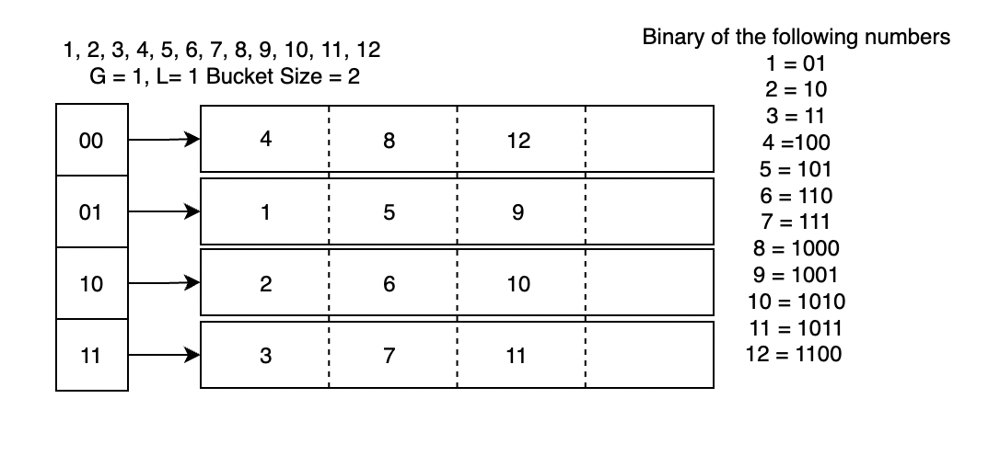

# Unit 1 #

## Advanced Data Structures ##

```c++
    if(curr == root)    // deletion of root node
    {
        if( curr -> rightc == NULL)
            root = root -> leftc;
        elsei if ( curr -> leftc == NULL)
            root = root -> rightc;
    }


    else if(curr!=root)
    {
        if(curr)
    }
    
    ##############################################
    

    else if(curr!=root)
    {
        if(curr left and right is NULL)
        {
            if(parent->leftc==curr)
            parent->leftc = NULL;
            else
            parent->rightc = NULL;
        }
        else if(curr->leftc is NULL)
        {
            if(parent->leftc==curr)
            parent
        }
    }

    ##############################################

    else    // deletion of a node having two child
    {
        s=curr->rightc;
        temp=curr->leftc;
        while(s->leftc!=NULL)
        {
            s=s->leftc;
        }
        s->leftc=temp;
        if(parent->leftc==curr)
            parent->leftc=curr->rightc;
        else
            parent->rightc=curr->rightc;
    }

    Assign curr left and right to NULL;
    delete curr;
```

## Memory Representation of Threaded Tree ##

To maintain memory representation of threaded tree, we need a head pointer

```c++
    class tbtnode
    {
        cahr data;
        boo rbit;
        bool lbit;
        tbtnode *rightc;
        tbtnode *leftc;
        friend class tbt;
        public:
            tbtnode();
    };

    tbtnode::tbtnode()
    {
        lbit = 1;
        rbit = 1;
    }

    class tbt
    {
        tbtnode *head;
        public:
        void create();
        void preorder();
        tbtnode * presuccr(tbtnode*temp);
        void inorder();
    }

    ################################################################

    create()
    {
        allocate memory for root;
        accept root data;
        assignhead lbit to 0;
        assign root -> leftc and rightc to head;
        assign head -> leftc to root;

        do 
        {
          initialize flag to 0;
          temp = root; allocate memeory to curr and accept curr->data;  
        }
        while(flag==0)
        {
            accept choice left or right;
            if ch1='1'
            {
                if(temp->lbit==1)
                {
                    curr->rightc=temp;
                    curr->leftc=temp->leftc;
                    temp->leftc=curr;
                    temp->lbit=0;
                    flag=1;
                }
                else 
                    temp=temp->leftc;
            }
        }
    }

    ################################################################

    inorder()
    {
        temp = head;
        while(1)
        {
            temp=inordersucc(temp);
            if(temp==head) break;
            print temp->data;
        }
    }

    node*inordersucc(temp)
    {
        x=temp->rbit;
        if(temp->rbit==0)
        {
            while(x->lbit==0)
                x=x->left;
        }
    }

    ################################################################

    preorder()
    {
        assigne temp to head->left;
        while(temp!=head)
        {
            print temp->data;
            while(temp->lbit!=1)
            {
                move temp to temp->left;
                print temp->data;
            }
            while(temp->rbit ==1)
                move temp to temp->right;
                move temp to temp ->right;
        }
    }
```

Disadvantages of threaded binary tree:

- Insertion and deletion from a threaded tree are vey time consuming operation compared to non-threaded binary tree.
- This treee require additional bit to indentify the threaded link.

## Depth First Traversal (Recursive) ##

Algorithm

```c++
     DFS()
    {
        //initially no vertex will be visited
        for (int i = 0; i < n ; i++)
        visited[i] = 0;
        //start search at vertex v
        accept starting vertex v
        DFS(v);
    }
    '''
Algorithm

    '''
    DFS(int v)
    {
        print v;
        visited[v]=1;
        for(each vertex w adjacent to v)
            if(!visited[w])
            DFS(w);
    }
    {
        for all vertices of graph
            visited[i] = 0;
        push(v);
        visited[v]=1;
        do
        {
            
        }
    }
```

## Spanning Tree ##

- A spanning tree is any tree that consists of solely of edges in G and that includes all the vertices.
- A spanning tree is a minimal subgraph, G', of G such that V(G') = V(G) and G' is connected.
- Either dfs or bfs can used to create a spanning tree.

## Minimum Spanning Tree ##

Applications of minimum spanning tree:

      - Telephone
      - Electrical 
      - TV cable 
      - Computer 
      - Road

## Greedy Strategy ##

- An optimal solution is constructed in stages.
- At each stage, the best decision is made at this time.
- Since this decision cannot be changed later, we make sure that the decision will result in a feasible silution.
- Typically, the selection of an item is based on the value of the item.

## Kruskal's Algorithm ##

- Build a minimum cost spanning tree by adding edges one at a time.
- At each step, add the edge that has the least cost.
- If the edge being added forms a cycle, then discard it.
- If the edge being added does not form a cycle, then add it to the spanning tree.
- Repeat until all the vertices are included in the spanning tree.
- The algorithm is called greedy because at each step, the algorithm selects the edge with the least cost.
- The algorithm is called Kruskal's algorithm because it was developed by Joseph Kruskal.

## Introduction to Hashing ##

Suppost that we want to store 10,000 students records (each with a 5-digit ID) in a given container

- A linked list implementation would take O(n) time.
- A height balanced tree would give O(log n) access time.
- Using an array of size 100,000 would give O(1) access time but will lead to a lot of space wastage.

Is there some way taht we could get O(1) access time and also use less space?

Example
31,42,35,67,24,19
F(x) = x mod 10

|Location|X|
|:-:|:-:|
|1|31|
|2|42|

## Origins of the Term Hashing ##

The term "**Hash**" comes by way of analogy with its standard meaning in the physical world, to "*chop and mix*"

## Hashing ##

Use hassh function to map keys into positions in a hash table.

Ideally

- if element *e* has key *k* and *h* is hash function, then *e* is stored in position *h(k)* of table.
- To search for *e*, compute *h(k)* to locate position. If no element, dictionary does not contain *e*.

**Characteristics of a Good Hash Function:**

- The average performance of hashing depends on how the hash function distributes the set of keys among teh slots.
- Assumption is taht any given record is equally likely to hash into any of the slots, indepedently of whether any other record has been already hashed to it or not.
- Thes assumption is called as simple uniform hashing.
- A good hsah function is the one which satisfies the assumption of simple uniform hashing.
- Address generated from the key are unifromly and randomly distributed.
- Small variations in the vlaue of the key will cause large variations in the record addresses to distribute records (with similar keys) evenly.

## Extendible hashing Algorithm ##

The following points explain how the algorithm work:

- Initialize the bucket depths and the global depth of the directories
- Convert data into binary representation.
- Consider the global depth number of the least significant bits (LSBs) of data.
- Map the data accordding to the ID of a directory.
- Check for the following conditions if a buckey overflows (if teh number of elements in a bucket exceeds the set limit):

    1. Global depth == Bucket depth: Split the bucket into two and increment the global depth

**PracticeQuestion:**


