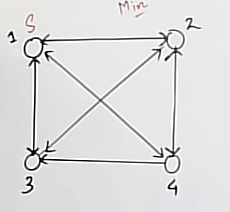
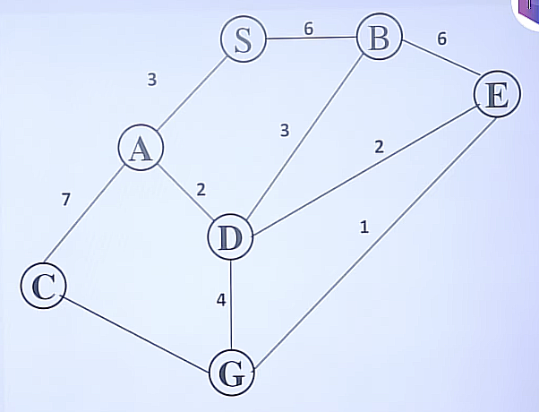

# Greedy Algorithms #

- Follows local optimal choice at each stage with intent of finding global optimum
- Feasible Solution
- Optimal Solution

Applications:

- Knapsack Problem
- Job Sequencing Problem
- Minimum Spanning Tree
- Optimal Merge Pattern
- Huffman Coding
- Dijkstra's Algorithm

## 1. Knapsack Problem ##

| `Objects` | object 1 | object 2 | object 3 |
|---------|----------|----------|----------|
| `Profit`  | 25       | 24      | 15      |
| `Weight`  | 18       | 15       | 10       |

Knapsack Capacity(M) = 20

- Greedy about profit:

1. First as the profit of the first `object 1` is highest so, we will add it to the bag first
2. Now, the capacity of the bag is 2.
3. Now, if we add `object 2` or `object 3` then the capacity will be exceeded.
4. Now, adding `object 2` to the bag $25 + \frac{2}{15}*24$ Which is 28.

- Greedy about weight:

1. First as the weight of the first `object 3` is lowest so, we will add it to the bag first
2. Now, the lowest weight is of `object 2` so, we will add it to the bag.
3. Now, the profit is $15 + \frac{10}{15}*24$ Which is 31.

- Greedy about both:

1. First we'll find the profit/weight ratio of each object.

| `Objects` | object 1 | object 2 | object 3 |
|---------|----------|----------|----------|
| `Profit`  | 25       | 24      | 15      |
| `Weight`  | 18       | 15       | 10       |
| `Ratio`   | 1.3     | 1.6      | 1.5      |

- Now, we will add the objects in the bag according to the ratio.
- First, we will add `object 2` to the bag.
- Now, the capacity of the bag is 5.
- Now, we will add `object 3` to the bag.
- Now, the profit is $24 + \frac{5}{10}*15$ which is 31.5.

*Algorithm:*

- for i = 1 to n calculate profit/weight O(n)
- Sort objects in decreasing order of profit/weight ratio   O(nlogn)

```c
for i = 1 to n 
    if M>0 and W`i` <= M
        M = M - W`i`
        profit = profit + P`i`
    else
        profit = profit + (M/W`i`) * P`i`
        break
```

O(n)

## 2. Huffman Coding ##

- Used for data compression

**Example:**

- We have a message M = 100 words
- In ASCII we have the range from 0 to 127 characters. We have 7 bits to represent each character.
- So in total we need 700 bits to represent the message.
- We have the following frequency table:

| `Character` | A | B | C | D | E | F |
|---------|----------|----------|----------|----------|----------|----------|
| `Frequency`  | 50       | 10      | 30       | 5      | 3      | 2      |

- Now, we will assign the binary code to each character.
- a = 000, b = 001, c = 010, d = 011, e = 100, f = 101
- To represent each character we need 3 bits.
- Total bits required to represent the message = 300 bits.
- But Huffman Coding says that we can reduce the number of bits required to represent the message.
- It says that initially pick two characters with lowest frequency
- In this case, we will pick `e` and `f` as they have the lowest frequency.

          5
         / \
        e   f

- Now, we will take the next character with lowest frequency.
- In this case, we will pick `d`  as it has the lowest frequency.

        10
       /  \
      d    5
            / \
           e   f
- Now, we will take the next character with lowest frequency.

          20
         /  \  
        b    10
            /  \
           d    5
               / \
              e   f
- Now, we will take the next character with lowest frequency.

          50
         /  \  
        c    20
            /  \  
           b    10
               /  \
              d    5
                  / \
                 e   f
- Now, we will take the next character with lowest frequency.
- In this case, we will pick `a` as it has the lowest frequency.

         100
         / \
        a   50
           /  \  
          c    50
              /  \  
             b    20
                 /  \  
                d    10
                    /  \
                   e    f
- This is the Huffman Tree.
- Now, we will assign the binary code to each character.

    a = 0   50*1
    b = 100 10*3
    c = 11  30*2
    d = 1010    5*4
    e = 10111   3*5
    f = 10110   2*5
- Total bits required to represent the message in `huffman coding` = 1\*50 + 3\*10 + 2*30 + 4\*5 + 5\*3 + 5\*2 = 185 bits.
- Avg bits required to represent a character = 185/100 = 1.85 bits.

**Question:**

*Consider the following message `aa bbbb a bbb ccc ddd eee ccc eee dd eee` Find the no. of bits required for `Huffman encoding` of above message also find the avg bits required to represent a character?*

*Solution:*

| `Character` | a | b | c | d | e |
|---------|----------|----------|----------|----------|----------|
| `Frequency`  | 3       | 7      | 6       | 5      | 9      |

- Initially, we will pick `a` and `d` as they have the lowest frequency.

      8
     / \
    a   d
- Now, we will pick `c` and `b` as they have the lowest frequency.

       13          8
      /  \        / \
     b    c      a   d

- Now, we will pick `e` as it has the lowest frequency.

               30
          /           \
         /            17
        /            /  \
       13          8    e
      /  \        / \
     b    c      a   d
          
- Now, we will assign the binary code to each character:

    a = 3*3 = 9
    b = 7*2 = 14
    c = 6*2 = 12
    d = 5*3 = 15
    e = 2*9 = 18
- The total bits used in `Huffman Coding` = 9 + 14 + 12 + 15 + 18 = 68 bits.
- The avg bits required to represent a character = 68/30 = 2.26 bits.

## 3. Travelling Salesman Problem ##

- Given a graph and we have to find the shortest path to visit all the vertices of the graph.
- We have to start from a vertex and end at the same vertex.
- We have to visit each vertex only once.
- We have to find the shortest path.
- We have to find the minimum cost.

**Example:**

Consider the following graph:



  1   2   3   4
1[0 , 10, 15, 20]
2[5 , 0 , 25, 10]
3[15, 30, 0 ,  5]
4[15, 10, 20,  0]

- We have to start from vertex 1 and end at vertex 1.
- We have to visit each vertex only once.
- So, we will go from 1 to 2 and the cost will be 10.
- Now, from 2 we will go to 4 and the cost will be 10.
- Now from 4 we will go to 3 and the cost will be 20.
- Now from 3 we will go to 1 and the cost will be 15.
- So, the total cost will be 10 + 10 + 20 + 15 = 55.
- This is the shortest path to visit all the vertices of the graph.

## 4. 0/1 Knapsack Problem ##

Knapsack (0- absent, 1- present)

| Object | Object 1 | Object 2 | Object 3 |
|--------|----------|----------|----------|
| `Weight` | 2       | 4       | 8        |
| `Profit` | 20       | 25      | 60       |
| `Ratio` | 10       | 6.25      | 7.5       |

Knapsack Capacity(M) = 12

- Now, solving it by brute force approach.
- We will take all the combinations of the objects.
- We will take the combination of objects whose weight is less than or equal to the knapsack capacity.
- We will find the profit of each combination.
- We will find the maximum profit.
- So, the maximum profit will be 85.
- This is the maximum profit we can get by using brute force approach.
- But this approach is not efficient.

*Recursive Equation of 0/1 Knapsack:*

0/1 Knapsack(n,m) = 
`n` is the total no. of objects and `m` is the total weight of the knapsack.

- We have the first element let's say `n` so the profit will be `p` and the weight will be `w`.
- Now, the first case considering the element `n` in the knapsack.

$01KS(n-1),(m-w) + p$

- The second case not considering the element `n` in the knapsack.

$ 01KS(n-1),m$

- Now, we will take the maximum of both the cases.
- So, the recursive equation will be:

$01KS(n,m) = max(01KS(n-1),(m-w) + p, 01KS(n-1),m)$

If n = 3
    000
    001
    010
    011
    100
    101
    110
    111

- If the weight of an element is greater than the knapsack capacity then we will not consider that element.

$01KS(n-1,m) w>m$

- If the total no. of elements left is 0 or the knapsack capacity is 0 then the profit will be 0.

*Recursion Tree:*

01KS(4,4)

- Case 1: Considering the first element in the knapsack.

    $01KS(3,3) + 1$

- Case 2: Not considering the first element in the knapsack.

    $01KS(3,4)$

- Case 3: Considering the second element in the knapsack.

    $01KS(2,2) + 2$ if the 1st element is considered.
    $01KS(2,4)$ if the 1st element is not considered.

- Case 4: Not considering the second element in the knapsack.

    $01KS(2,4)$ if the 1st element is not considered.
    $01KS(2,2)$ if the 1st element is considered.

- Similarly, we will do the same for the rest of the elements and we will get the recursion tree.

## 5. Branch and Bound Algorithm ##

- Branching is the process of generating subproblems.
- Bounding refers to ignoring partial solutions that cannot be better than the current best solution.
- It is a search procedure to find the optimal solution.
- It eliminates those parts of a search space which does not contain better solution(Pruning).
- In this method we basically extend the cheapest partial path.



- Initial cost of S is 0.
- Now, from S we can go from S to A and B.
- Now, as A is cheaper than B so we will extend A.
- Now, from A we can go to C and D.

## 6. 0/1 Knapsack using Branch and Bound ##

| i | 1 | 2 | 3 | 4 |
|---|---|---|---|---|
| p | 30 | 28 | 20 | 24 |
| w | 5 | 7 | 4 | 2 |

