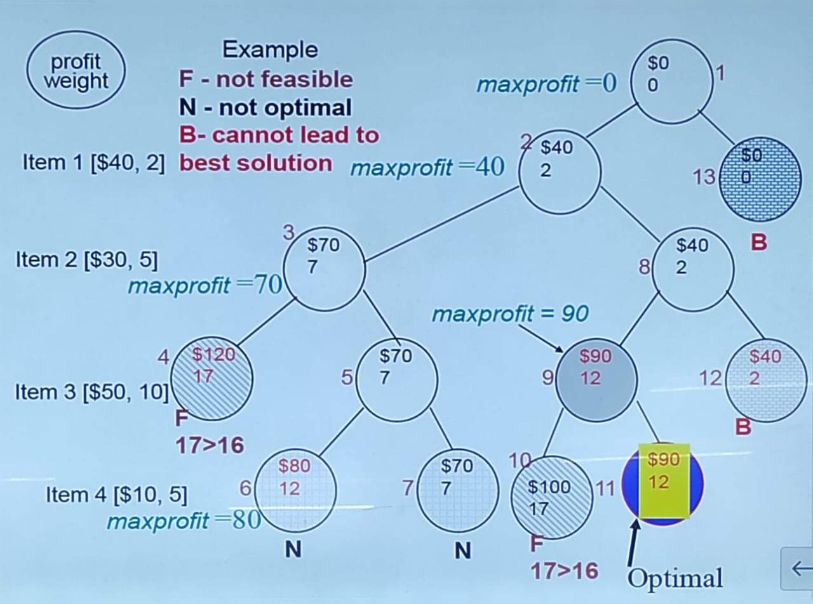
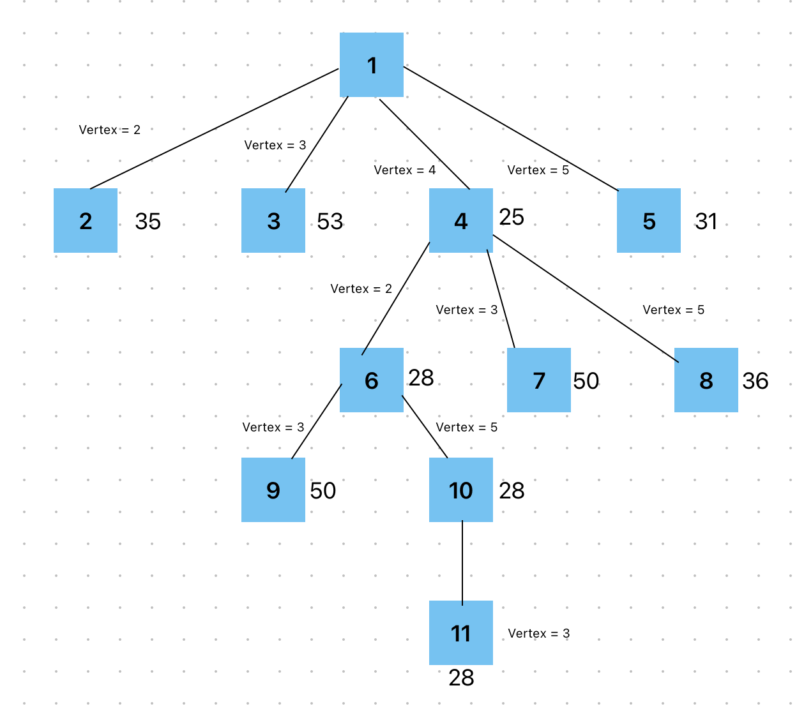

# Unit 3 - Backtracking and Branch-N-Bound #

Backtracking

        - Recursive backtracking algorithm 
        - Iterative backtracking method
        - 8-Queen problem
        - Hamiltonian Cycle
        - 0/1 Knapsack problem

Branch-N-Bound

        - Branch-N-Bound method
        - Control abstractions for least cost search 
        - Bounding

## Basic Concepts ##

Live Node

    - A node which has been generated and all of whose children have not yer been generated is a live node

E-Node

    - The live node whose children are currently being generated is called an e-node

Dead Node

    - A node which is not to be expanded further or all of whose children have been generated is called a dead node

Bounding Function

    - It is usde to kill live nodes without generating all their children

## Backtracking Outline ##

- General Method
- Recursive Backtracking Method
- Iterative Backtracking Method
- 8-Queen Problem
- Hamiltonian Cycle
- 0/1 Knapsack Problem

## Backtracking Algorithm ##

- Based on depth-first recursive search
- Approach

    1. Tests whether solution has been found
    2. If found solution, return it
    3. Else for each choice that can be made
        a. Maek that choice
        b. Recur
        c. Unmake that choice
        d. If solution found, return it
        d. Else continue to next choice

## Hamiltonian Cycles ##

Definitions

    - Hamiltonian cycle (HC): is a cycle which passes once and exactly once through every vertex of G and returns to starting positon.
    - Hamiltonian path (HP): is a path which passes once and exactly once through every vertex of G and returns to starting positon.

A graph is Hamiltonain if a Hamiltonian cycle (HC) exists.

    ```
    Algorithm Hamiltonian(k)
    {
        repeat
            {
                //generate values for x[k]
                Nextvalue(k); // assign a legal next value to x[k]
                if (x[k] = 0 )then return
                if (k = n) then write (x[1:n]);
                else Hamiltonain(k+1);
            }until(false);
    }
    ```
*X[1 : k -1] is a pth of k - 1 distinct vertices if x[k] = 0, then no vertex has as yet been assigned to x[k]. After executioin x[k] is assigned to the next higheest number vertex which does not already apear in x[1, k - 1] and is connected by an edge to x[k -1]. otherwise x[k] = 0, if k = n then in addtion x[k] is connected to x[1].*

    ```
    Algorithm Nextvalue(k)
        {
                repeat
                {
                        x[k] = (x[k] + 1) mod (n + 1) //next vertex
                        if (x[k] = 0) then return
                        if G[x[k-1], x[k]] /= 0 then
                        {
                                for j = 1 to k - 1 do if (x[j] = x[k]) then break; // check distinctness
                                if (j = k) then //if true then vertex is distinct
                                if ((k < n) or (k = n) and (G[x[n], x[1]] /= 0)) then return //if true then cycle is hamiltonian
                        }
                }until(false);
        }
    ```
**continued**
*This algorithm uses the recursive formulation of backtracking to find the hamiltonian cycles of a graph The graph is sotred as an adjacency matrix G[1:n, 1:n]. All cycles begins at node 1.*

        ```
        Algorithm Hamiltonian(k)
        {
                repeat
                {
                        // generate values for x[k]
                        Nextvalue(k); // assign a legal next value to x[k]
                        if (x[k] = 0) then return
                        if (k = n) then write (x[1:n]);
                        else Hamiltonian(k+1);
                }unitl(false);
        }
        ```

## Applications of Hamiltonian Cycles ##

- Hamiltonian cycles in fauld random geometric network
- In a network, if Hamiltonian cycles exist, the fault tolerance is better.

## Knapsack Backtracking ##

- We are given n objects and a knapsack or bag. The objective is to obtain a filling of the knapsack that maximizes the total profit earned.
- Given

        1. n = number of weights
        2. w = weights
        3. P = profits
        4. m = knapsack capacity

**Example:**

Suppose n = 4, w = 16, and we have the following:

| pi | wi | pi/wi |
|----|----|-------|
| 40 | 2  | 20    |
| 30 | 5  | 6     |
| 50 | 10 | 5     |
| 10 | 5  | 2     |


<p style="text-align:center;">Figure 1: DFS Tree Traversal of a Graph</p>

**Worst-case time complexity:**

- Check number of nodes:

    1 + 2 + 2^2^ + 2^3^ + ... + 2^n^ = 2^(n+1) - 1

- Time Complexity:

    O(2^n^)

## Outline ##

- the method
- control abstractions

    1. Least cost search
    2. Bounding

- FIFO branch and bound
- LC branch and bound
- 0/1 Knapsack problem

## Branch and Bound ##

- In backtracking , we used depth-first search with pruning to traverse the (virtual) state space. We can achieve better performance by using a breadth-first search pruning. This approach is known as branch-and-bound.
- Otherwise, the feasible regin is divided into two or more regions, these sup-problems partition the feasible region.
- The algorithm is applied recursively to each sub-problem.

**Branch and Bound:**

1. FIFO Branch and Bound (Queue)
2. LIFO Branch and Bound (Stack)
3. LC Search (Priority Queue)

*Example:*
       1
      / \ \ \
    2   3  4  5
   / \ / \  \
   6 7 8  9 10

Queue: 1, 2, 3, 4, 5, 6, 7, 8, 9, 10

Given the following cost matrix:
| inf | 20 | 30 | 10 | 11 |
| --- | -- | -- | -- | -- |
| 15 | inf | 16 | 4 | 2 |
| 3 | 5 | inf | 2 | 4 |
| 19 | 6 | 18 | inf | 3 |
| 16 | 4 | 7 | 16 | inf |

**State Space Tree:**


