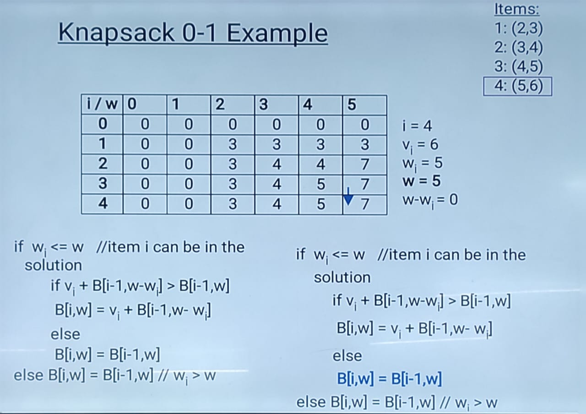

# Unit 4 - Dynamic Programming #

        - Principle of optimality
        - 0/1 Knapsack problem
        - Largest common subsequence problem
        - Multistage graph problem (using forward computation)
        - Travelling Salesman Problem (using dynamic programming)

## Fractional Knapsack Problem ##

fractional knapsack 0<=xi<=1
0/1 knapsack xi=0 or xi=1

## Dynamic Programming ##

- Dynamic Programming is typically applied to aptimization problem.
- Dynamic Programming is an algorithm design method that can be used when the solution to a problem may be viewed as the result of a sequence of decisions.

**WHY DYNAMIC PROGRAMMING?**

- **Divide and conquer:** a top-down approach. partitions a problem into independent subproblems.
- **Greedy Method:** only works with the local information.
- **Dynamic Programming:** a bottom-up approach. Solutions for smaller instances are stored in a table for later use.

## Knsapsack 0-1 Problem ##

- As we did before we are going to solve the problem in terms of subproblems.
        - So let's try to do that.
- Our first attemp might be to characterize a subproblem as follows:
        - Let Sk be the optimal subset of elements form {I0, I1, I2, ..., Ik} that has a total weight of k.

**Knapsack 0-1 Example:**



## Largest/Longest Common Subsequence Problem ##

- A subsequence is a sequence that appears in the same relative order, but not necessily contiguous. For example, 'abc', 'abg', 'bdf', 'acg', 'acefg', ... are subsequences of 'abcdefg'.
- **Problem:** Given tow sequences X = {x1, x2, ..., xm} and Y = {y1, y2, ..., yn}, find the longest subsequences Z = {z1, z2, ..., zk} that is common to X and Y.
- **For Example:** If X = {A, B, C, B, D, A, B} and Y = {B, D, C, B, A}, then some common sequences are:
{A} {B} {C} {D} {AA} {BB}
  
**Algorithm:**

        ```c++
        {c[i,j] is maximum length of array}

        m = length of (X):
        n = length of (Y):
        for i = 1 to m do
        c[i,0] = 0;
        for j = 0 to n do
        c[0,j] = 0;
        ```
Given two strings are X = BACDB and Y = BDCB, the longest common subsequence is BCB.

## Multiplication of Large Integers ##

- Consider the problem of multiplying two (large) n-digit integers represented by arrays of their digits such as:

A = 12345678901357986429
B = 87654321284820912836

The grade-school algorithm:

a~1~ a~2~...a~n~
b~1~ b~2~...b~n~
(d~10~) d~11~ d~12~...d~1n~
(d~20~) d~21~ d~22~...d~2n~
... ... ... ... ...
(d~n0~) d~n1~ d~n2~...d~nn~

**Efficiency:** n^2^ one-digit multiplications

## First Divide-and-Conquer Algorithm ##

A small example: A *B where A = 2135 and B = 4014
A = (21* 10^2^ + 35) and B = (40 *10^2^ + 14)
So , A* B = (21 *10^2^ + 35)* (40 *10^2^ + 14)
= 21* 40 *10^4^ + (21* 14 *10^2^ + 35* 40) *10^2^ + 35* 14

In general, if A = A~1~ A~2~ and B = B~1~ B~2~ (where A and B are n-digit, A~1~, A~2~, B~1~, B~2~ are n/2-digit numbers), A *B = A~1~* B~1~ *10^n^ + (A~1~* B~2~ + A~2~ *B~1~)* 10^(n/2)^ + A~2~ * B~2~

Recurrence for the number of one-digit multiplications M(n):
    M(n) = 4M(n/2), M(1) = 1
Solution: M(n) = n^2^

## Travelling Salesman Problem ##

In the traveling salesman problem, a map of cities is given to the salesman and he has to visit all the cities only once and return to his starting point to complete the tour in such a way that the length of the tour is the shortest among all possible tours for this map.
Clearly starting from a given city, the salesman will have a total of (n-1)!
Diffrent sequences:

    - If n = 2, A and B, there is no choice.
    - if n =3, i.r. he wants to visit three cities inclusive of the starting point, he has 2! Possible routes and so on.

The Dynamic Programming proceeds as follows:-

Step-1

    - Consider teh given travelling salesman problem in which he wants to find that route which has shortest distance.

Step-2

    - Consider the set of 0 element, such that
        g(2, &phi;) = c21      g(3, &phi;) = c31      g(4, &phi;) = c41

Step-3

    After completion of step-2, consider sets of 1 elements, such that
    Set {2}:        g(3, {2}) = c32 + g(2, &phi;) = c32 + c21
                    g(4, {2}) = c42 + g(2, &phi;) = c42 + c21
    Set {3}:        g(2, {3}) = c23 + g(3, &phi;) = c23 + c31
                    g(4, {3}) = c43 + g(3, &phi;) = c43 + c31
    Set {4}:        g(2, {4}) = c24 + g(4, &phi;) = c24 + c41
                    g(3, {4}) = c34 + g(4, &phi;) = c34 + c41

Step-4

    After completion of step-3, consider sets of 2 elements, such that
    Set {2, 3}:     g(4, {2, 3}) = min{c43 + g(2, {3}) = c43 + c23 + c31}
    Set {2, 4}:     g(3, {2, 4}) = min{c34 + g(2, {4}) = c34 + c24 + c41}
    Set {3, 4}:     g(2, {3, 4}) = min{c24 + g(3, {4}) = c24 + c34 + c41}

Step-5

    After completion of step-4, Find the length of an optimal tour:
    f = g(1, {2,3,4}) = min{c12 + g(2, {3,4}), c13 + g(3, {2,4}), c14 + g(4, {2,3})}

Step-6

    After completion of step-5, Find the optimal TSP tour

|0|2|9|10|
|---|---|---|---|
|1|0|6|4|
|15|7|0|8|
|6|3|12|0|

**Set {2}:**

g(3, {2}) = c32 + g(2, &phi;) = c32 + c21

    c32 = 7, c21 = 1
    g(3, {2}) = 7 + 1 = 8

g(4, {2}) = c42 + g(2, &phi;) = c42 + c21

    c42 = 3, c21 = 1
    g(4, {2}) = 3 + 1 = 4

**Set {3}:**

g(2, {3}) = c23 + g(3, &phi;) = c23 + c31

    c23 = 6, c31 = 15
    g(2, {3}) = 6 + 15 = 21

g(4, {3}) = c43 + g(3, &phi;) = c43 + c31

    c43 = 12, c31 = 15
    g(4, {3}) = 12 + 15 = 27

**Set {4}:**

g(2, {4}) = c24 + g(4, &phi;) = c24 + c41

    c24 = 4, c41 = 6
    g(2, {4}) = 4 + 6 = 10

g(3, {4}) = c34 + g(4, &phi;) = c34 + c41

    c34 = 8, c41 = 6
    g(3, {4}) = 8 + 6 = 14

**Set {2, 3}:**
