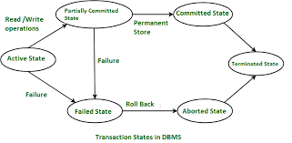
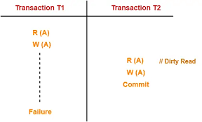
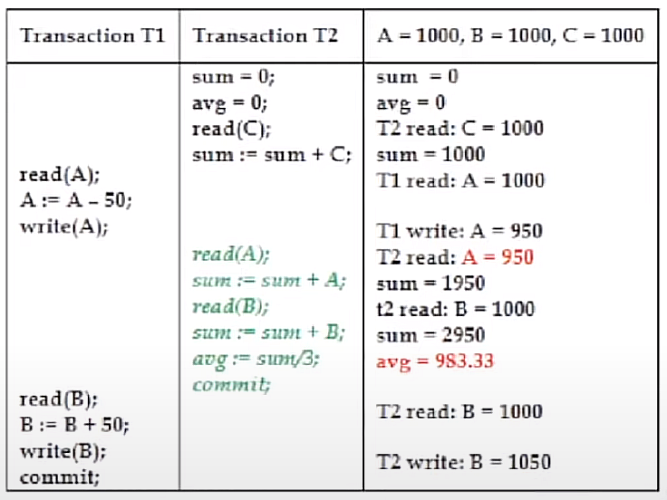
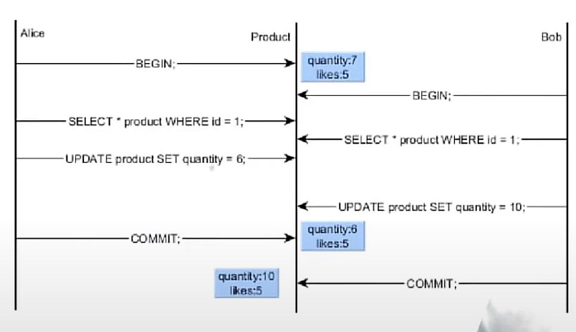
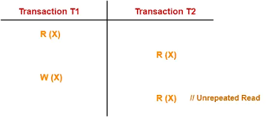
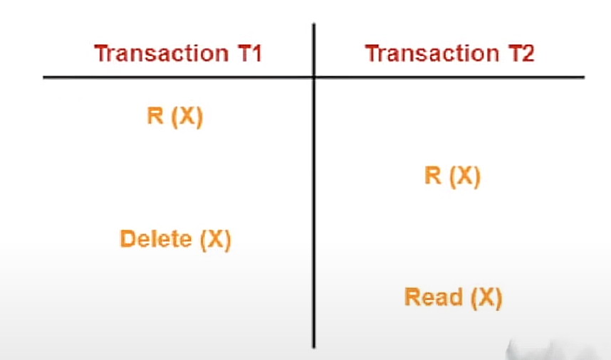
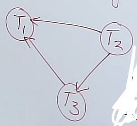

# Unit-5 Transaction Management and Concurrency Control ##

## 5.1 Transaction Management ##

**Transaction:**

- It is a set of operations used to perform a logical unit of work.
- A `Transaction` generally represents any change in database.
- There are two major operations that come under `trasaction`:

    1. Read Operation
    2. Write Operation
    3. Commit Operation

- Now, if any process takes place in the database, first the `read operation` will take place then the `write operation` will take place and finally the `commit operation` will take place.
- The `read operation` is mainly used to read the data from the database.
- The `write operation` is mainly used to write the data into the database.
- The `commit operation` is mainly used to save the data into the database.
- The `commit operation` takes places only if the `write operation` is successful.

## 5.2 Acid Properties in Transaction ##

The main four main acid properties in transaction are:

    1. Atomicity
    2. Consistency
    3. Isolation
    4. Durability

### 5.2.1 Atomicity ###

- Either all or None of the operations in a transaction are performed.(i.e., if any of the transaction operation fails, then the whole transaction fails and rollback the changes made by the transaction).

- A failed transaction is aborted and all the changes made by the transaction are rolled back, and the database is restored to its state before the transaction started.

- The `Atomicity` property ensures that either all operations of a transaction are reflected properly in the database or none are reflected at all.

### 5.2.2 Consistency ###

Consistency in databases refers to keeping data in a valid and expected state. It ensures that the database remains reliable and adheres to defined rules or constraints. Consistency is one of the ACID properties that guarantee data integrity. It involves maintaining valid states during transactions and enforcing integrity constraints. In distributed systems, consistency models define the level of consistency guarantees provided. Strong consistency ensures all nodes see the same data simultaneously, while eventual consistency allows temporary inconsistencies. Consistency is vital for data reliability, accuracy, and trustworthiness in applications.

`Consistency` in Database Systems:

  1. Atomicity: All changes within a transaction are either committed or rolled back as a single unit, ensuring that the database remains in a consistent state.
  2. Consistency: The database transitions from one consistent state to another consistent state after the successful execution of a transaction.
  3. Isolation: Concurrently executing transactions do not interfere with each other, providing the illusion that they are executing serially.
  4. Durability: Committed changes are persistent and will survive any subsequent failures or system restarts.

### 5.2.3 Isolation ###

- The `Isolation` property ensures that multiple transactions can occur concurrently without leading to inconsistency of database state.

- The `Isolation` property ensures that the execution of transactions concurrently will result in a state that is equivalent to a state achieved these were executed serially in some order.

- In this we try to convert a parallel schedule to a serial schedule.

### 5.2.4 Durability ###

- The `Durability` property ensures that once a transaction has been committed, it will remain so, even in the event of power loss, crashes, or errors.

## 5.3 Transaction States ##

### 5.3.1 Active State ###

- The initial state of a transaction is called the `Active State`.

- In this state, the transaction is being executed.

- In this state, we are talking about the RAM memory.

### 5.3.2 Partially Committed State ###

- All the operations of the transactio are executed except the `commit operation`.
- In this state, we are talking about the RAM memory.
- In this state, the transaction is not yet committed.
- In this state, the transaction is not yet saved in the database.

### 5.3.3 Committed State ###

- All the operations of the transaction are executed including the `commit operation`.
- In this state, we are talking about the Hard Disk memory.
- In this state, the transaction is committed.
- In this state, the transaction is saved in the database.

### 5.3.4 Failed State ###

- If any of the operations of the transaction fails, then the transaction is said to be in the `Failed State`.
- In this state, we are talking about the RAM memory.
- In this state, the transaction is not yet committed.
- In this state, the transaction is not yet saved in the database.

### 5.3.5 Aborted State ###

- If any of the operations of the transaction fails, then the transaction is said to be in the `Aborted State`.
- In this state, we are talking about the Hard Disk memory.
- In this state, the transaction is not committed.
- In this state, the transaction is not saved in the database.
- In this state, the transaction is rolled back.
- In this state, the transaction is restored to its original state.
- In this state, the transaction is deleted from the database.
- It is also the state which kills or restarts the transaction.

### 5.3.6 Terminated State ###

- A transaction is terminated in both the cases whether it is in the `Committed State` or in the `Aborted State`.
- In this state, we are talking about the RAM memory.
- In this state, if the transaction is committed successfully then the transaction is terminated and the data is saved in the database.
- In this state, if the transaction is failed and aborted, then the transaction is terminated and rolledback and the data is not saved in the database.

## 5.4 Transaction Schedules ##

- It is a chronological sequence of multiple transactions.

There are two types of schedules:

    1. Serial Schedule
    2. Paralles Schedule

### 5.4.1 Serial Schedule ###

- This mean that if there are three transactions `T1, T2, T3` then the transaction `T1` will be executed first, then the transaction `T2` will be executed and finally the transaction `T3` will be executed.
- In this type of schedule, the transactions are executed one after the other.
- In this type of schedule, until one transaction is completed, the other transaction cannot be started.
- In this schedule the waiting time and execution time is more.
- They are consistent and reliable, but the efficiency is less.

### 5.4.2 Parallel Schedule ###

- In this schedule if we are executing the transaction T1, and another transaction comes in queue, then we will not wait for the T1 transaction to be completed, we will start the execution of the T2 transaction simlutaneously.
- In this schedule the waiting is less and the efficiency is more.

**Throughput:** It is the number of transaction that are executed per unit time. It is directly proportional to the performance.

## 5.5 Concurrency Control ##

- Concurrency refers to the ability of multiple tasks or operations to occur simultaneously in a database or system. It allows multiple users or processes to access and manipulate data concurrently.

- For example, consider an e-commerce website where multiple customers can place orders simultaneously. The system should be able to handle these concurrent requests and process them concurrently without conflicts. Each customer's order is treated as a separate transaction, and the system ensures that the data remains consistent and accurate throughout the ordering process, regardless of the simultaneous activities.

- Concurrency control mechanisms, such as locks, isolation levels, and conflict resolution strategies, are implemented to coordinate and synchronize these concurrent operations. They ensure that data integrity is maintained and that the concurrent activities do not lead to unexpected or incorrect results.

- By enabling concurrency, systems can improve performance, increase throughput, and provide a better user experience by allowing multiple users to interact with the system simultaneously.

## 5.6 Types of Problems in Concurrency ##

Types of problems in concurrency:

    1. Dirty read
    2. Incorrect Summary
    3. Lost update
    4. Unrepetable read
    5. Phantom read 

### 5.6.1 Dirty Read ###

*A dirty read occurs when a transaction reads data from a database that has been modified by another transaction but not yet committed. It means reading uncommitted and potentially inconsistent data that may be rolled back later, leading to incorrect or misleading results.*

- Let's say we have two transactions `T1` and `T2`.
- `T1` reads the values for `R(A)` as `100` and `R(B)` as `50`.
- `T2` updates the values for `W(A)` as `50` and `W(B)` as `40` and the transaction is committed.
- Let's say that in future the transaction `T1` fails.
- Then, we will rollback the transaction `T1`.
- In this case, the transaction `T1` has read the values of `A` and `B` which are not yet committed.

### 5.6.2 Incorrect Summary ###

*An incorrect summary is a brief description that contains wrong or misleading information. It doesn't accurately represent the main points and can lead to confusion or misunderstandings. Summaries should be accurate to avoid spreading incorrect information.*

- Let's say we have two transactions `T1` and `T2`.
- `T1` reads the values for `R(A)` as `1000` and `R(B)` as `950`.
- `T2` reads the value of `R(A)` as `950` and performs average operation on it and updates the value of `W(A)` as `983` and the transaction is committed.
- Then the transaction `T1` reads the value of `W(B)` as `1000` and adds `50` to it and updates the value of `W(B)` as `1050` and the transaction is committed.

In this case, the transaction `T2` has read the wrong value and calculated the wrong average.

### 5.6.3 Lost Update ###

*A lost update refers to a situation where the changes made by one transaction in a database are overwritten or lost due to a subsequent update by another transaction. This can result in the unintended loss of data and can lead to inconsistencies or incorrect results in the database.*

- Let's say a transaction is started `SELECT * product WHERE id = 1;` and another transaction in between reads the same value.
- Then, the first transaction updates the quantity to `6` and the second transaction updates the quantity to `10`.
- The first transaction after being commited gets `5` likes and the second transaction after being commited gets `5` likes.
- As both the transactions are talking about the same value the total no. of likes should be `10` but as soon as the second transaction is commited the first transaction is lost and the total no. of likes becomes `5`.
&therefore; In this case, the first Transaction has lost the update.

### 5.6.4 Unrepetable Read ###

*An unrepeatable read refers to a scenario where a transaction reads the same data multiple times within the same transaction, but the values of the data change between the reads. This inconsistency can occur due to concurrent updates by other transactions, leading to varying results within a single transaction and potentially causing data integrity issues.*

- Let's say we have two transactions `T1` and `T2`.
- Initially both the transaction reads the value of `R(A)` as `100`.
- `T1` updates the value of `W(A)` as `50` and the transaction is committed.
- `T2` reads the value of `R(A)` as `50` and the transaction is committed.
- This is known as unreatable read because the value of `A` has changed between the two reads.

### 5.6.5 Phantom Read ###

*A phantom read refers to a situation in which a transaction retrieves a set of rows from a database based on a certain condition, but when the transaction repeats the same query, additional rows that meet the condition appear. It is called a phantom read because it seems like new rows have appeared as if by magic. Phantom reads can occur due to concurrent transactions inserting or deleting rows that match the query condition, resulting in inconsistent or unexpected query results.*

- In this, the `T1` transaction reads the value of `R(A)` as `10` and the transaction `T2` also reads the values of `R(A)` as `10`.
- And let's say that lates transaction `T1` delets the value of `R(A)` then, the transaction `T2` will also try to delete the value, and this in known as `Phantom Read`.

## 5.7 Write Read Confllict (Dirty Read Probelm) Question ##

A value in the database is `70`

| T1 | T2 |
| -- | -- |
| A = A-50 | |
| W(A) | |
| | R(A) |
| | A = A*2 |
| | W(A) |
| R(B) | |
| W(B) | |

- In this case, the transaction `T1` reads the value of `A` as `70` and updates the value of `A` as `20` and the transaction is committed.
- Then, the transaction `T2` reads the value of `A` as `20` and updates the value of `A` as `40` and the transaction is committed.
- In this case, the transaction `T2` has read the wrong value and calculated the wrong average.
- The value of `A` is restored to `70` and the transaction `T1` is rolled back.

## 5.8 Read Write Conflict (Unrepeatable Read) Question ##

A value in the database is `2`

| T1 | T2 |
| -- | -- |
| R(A) | |
| | R(A) |
| | W(A) |
| R(A) | |
| W(A) | |
| commit | |

*Taking an example of train ticket reservation:*

- `T1` reads the value of A as `2` and `T2` also reads the value of `A` as `2`.
- `T2` updates the value of `A` as `0` and the transaction is committed.
- `T1` reads the value of `A` as `0` and updates the value of `A` as `0` and the transaction is rolled back.

*Taking an example of books in library:*

Value of `A` is `10`

- `T1` reads the value of `A` as `10` and reserves a book and at the same time `T2` also reads the value of `A` as `10` and reserves a book and changes the value of `A` to `9`, and then `T1` also reserves a book and changes the value of `A` to `9`.
- The value of `A` is chnaged to `9` two times, which is wrong.
- This is due to `Read Write Conflict`.

Cases on Same database:

| T1 | T2 |
| -- | -- |
| R(A) | R(A) |
| R(A) | W(A) |
| W(A) | R(A) |
| W(A) | W(A) |

- If two people are reading the database at the same time then there is no problem.

## 5.9 Irrecovrable Schedule (Lost Update) Question ##

Value of `A` is `10`

| T1 | T2 |
| -- | -- |
| R(A) | |
| A = A-5 | |
| W(A) | |
| | R(A) |
| | A = A-2 |
| | W(A) |
| R(B) | |
| * | |
| fail | |

- `T1` reads the value of `A` as `10` and updates the value of `A` as `5` and the transaction is committed.
- `T2` reads the value of `A` as `5` and updates the value of `A` as `3` and the transaction is committed.
- The value of `A` is updated as `3` in the database.
- The transaction `T1` is failed and the transaction is rolled back.
- The value of `A` is restored to `10` in the database.
- The transaction `T2` is failed and the transaction is rolled back.

## 5.10 Cascading Schedule vs Cascadeless Schedule ##

| Cascading Schedule | Cascadeless Schedule |
| ------------------ | -------------------- |
| § A cascading schedule is a schedule that has the cascading rollback property. | § A cascadeless schedule is a schedule that does not have the cascading rollback property. |
| § A cascading schedule is a schedule that has the cascading abort property. | § A cascadeless schedule is a schedule that does not have the cascading abort property. |
| § There is no write-write conflict in a cascading schedule. | § There is  write-write conflict in a cascadeless schedule. |

## 5.11 Serializability ##

*Serializability is simply a method to find out a clone for a given parallel schedule which is equivalent to the given parallel schedule and is serial in nature.*

There are two types of serializability:

    1. Conflict Serializability
    2. View Serializability

### 5.11.1 Conflict Serializability ###

Non-conflict Pair:

    - R(A) and R(A)
    - R(B) and R(A)
    - W(B) and R(A)
    - R(B) and W(A)
    - W(B) and W(A)

Conclict Pair:

    - R(A) and W(A)
    - W(A) and R(A)
    - W(A) and W(A)

*If there is no conflict pair in the schedule then the schedule is conflict serializable.*

**Examples:** Check conflict pairs in other transactions and draw edge.

| T1 | T2 | T3 |
| -- | -- | -- |
| R(X) | | |
|    |    | R(Y) |
|    |    | R(X) |
|    | R(Y) | |
|    | R(Z) | |
|    |    | W(Y) |
|    | W(Z) | |
| R(Z) | | |
| W(X) | | |
| W(Z) | | |

- There is conflict between `T2` and `T3`, `T2` and `T1` and `T3` and `T1`.
- Now, in the graph, if there is no cycle then the schedule is conflict serializable.
- As it is serializable so it consistent also
- Now, we will find the indegree of the graph, which the vertice where there is no incoming arrow.
- And we will remove the vertice with indegree 0 and the edges connected to it.
- Now, we will again find the indegree of the graph and remove the vertice with indegree 0 and the edges connected to it.
- We will repeat this process until there is no vertice left in the graph.
- If there is no vertice left in the graph then the schedule is conflict serializable.
- So, in this graph the first indegree is `T2`, so we will remove `T2` and its edges from the graph, then again when we find out the indegree of the graph `T3` is the indegree of the graph, so we will remove `T3` and its edges from the graph, then again when we find out the indegree of the graph `T1` is the indegree of the graph, so we will remove `T1` and its edges from the graph, and as `T1` was the last element of the graph, this concludes that the schedule is conflict serializable.

### 5.11.2 View Serializability ###

## 5.12 Concurrency Control Protocols ##

### 5.12.1 Shared-Exclusive Locking ###

- Shared Lock (S) -> if transaction locked data item in shared mode then allowed to read only.
- Exclusive Lock (X) -> if transaction locked data item in exclusive mode then allowed to read and write both.

- Now, we can grant share lock to two transactions at the same time as there is no conflict in Read-Read

- Now, if we have granted share lock to a transaction and another transaction is requesting for exclusive lock then we can't grant exclusive lock to the transaction because there is conflict in Read-Write.

- Now, if we have granted exclusive lock to a transaction and another transaction is requesting for share lock then we can't grant share lock to the transaction because there is conflict in Write-Read.

- Now, if we have granted exclusive lock to a transaction and another transaction is requesting for exclusive lock then we can't grant exclusive lock to the transaction because there is conflict in Write-Write.

**Problems in S/X Locking:**

- May not be sufficient to produce only serializable schedules.
- May not free from irrecoverability.
- May not free from deadlock.
- May not free from starvartion.

### 5.12.2 Two Phase Locking (2PL) ###

- Two Phase Locking is a protocol to ensure serializability.
- Growing Phase: locks are acquired and no locks are realesed.
- Shrinking Phase: locks are realesed and no locks are acquired.

**Lock Point:** Where the transaction starts relasing the first lock is know as the lock point of a transaction.

**Advantages of 2PL:**

- Always ensures serializability

**Disadvantages of 2PL:**

- May not free from irrecoverability.
- May not free from deadlock.
- May not free from starvartion.
- May not free from cascading rollback.

### 5.12.3 Strict 2PL, Rigorous 2PL and Conservative 2PL ###

- `Strict 2PL` should satisfy the basic 2PL and all exclusve locks hold until commit or abort.

- `Rigorous 2PL` should satisfy the basic 2PL and all shared, exclusive locks should hold until commit or abort.

- `Strict 2PL` is not free from irrecoverability

- `Rigorous 2PL` is free from irrecoverability

- `Conservative 2PL` says when a transaction starts it should acheive all the locks it needs for its execution.
- `Conservative 2PL` is free from deadlock.
