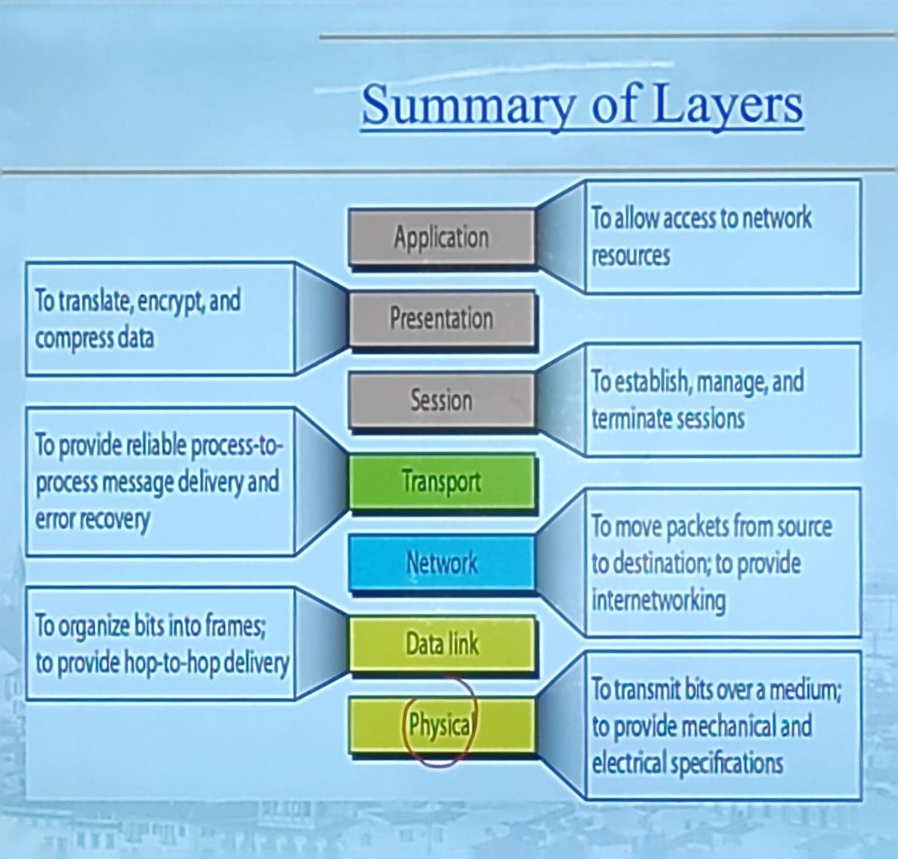

# Unit-4 Information and Cyber Secutrity ##

## 4.1 Syllabus ##

- Networks Securtiy FUndamentals, Layer-wise Security Concerns, FIrewalls: Packet Filtering, Stateless and Stateful, Intrusion detection systems: host based, network based IDS, Secured Socket Layer Secutity, IP level IPSEC security, E-mail Security: PGP, S/MIME.
- Cyber Security: Definition and origin, Cyber Crime and Information Security, Types of Cyber Crime, Classification of Cyber Criminals, Tools used in Cyber Crimes.

## 4.2 Summary of Layers ##

**Layer Wise Security Concerns:**

| Layer | Security Concerns |
| ----- | ----------------- |
| Application | Authentication, Authorization, Integrity, Non-repudiation |
| Transport | Integrity, Non-repudiation, Confidentiality |
| Network | Confidentiality, Integrity, Non-repudiation |
| Data Link | Confidentiality, Integrity, Non-repudiation |
| Physical | Confidentiality, Integrity, Non-repudiation |

## 4.3 Firewalls ##

- similar to a security guard
- protects an organization's network from unauthorized access
- Stands between internet and intranet
  
**Aims:**

- Establish a controlled link
- Protect the premises network from internet-based attacks
- Provide a single choke point

**Unauthorized access to the computer system by malicious user is detected as intrusion.**

- A firewall defines a single chode pint that keeps unauthorized users out of the protected network, prohibits potentially vulnerable services from entering or leaving the network, and provides protection from various kinds of IP spoofing and routing attacks.

**Limitations of Firewall:**

- The firewall cannot protect against that bypass the firewall.
- The firewall may not protect fully against internal threats, such as a disgruntled employee or an employee who unwittingly cooperates with an external attacker.
- An improperly secured wireless LAN may be accessed from outside the organization.
- A laptop, PDA, or portable storage device may be used and infected outside the corporation network, and then attached

**Types of Firewall:**

*Packet Filtering:*

also called screening router or screening filter.

- Filtering rules are based on numbre of fields in the IP and TCP/UDP headers.
- Recieve each packet. Apply rules. If no rules, apply default rules.

*Filtering Rules Example:*

| Policy | Firewall Setting |
| ------ | ---------------- |
| No outside Web access | Drop all outgoning packets to any IP address, port 80 |
| Outside connections to public web servers only. | Drop all incoming TCP SYN packets to any IP except 130.207,244.203, port 80 |
| prevent web-radios from eating up the available bandwidth | |

*Advantages:*

- simplicity
- transparency to users
- high speed

*Disadvantages:*

- diffuculty of setting up packet filter rules to allow all the desired traffic
  
**Countermeasures to attacks of Packet Filter FIrewall:**

- **IP address spoofing:** the counter measure is to discard packets with an inside source of address if the packet arrives on an external interface.
- **Source Routing attacks:** the counter measure is to discard all packets that do not analyze the source routing information.
- **Tiny fragment attacks:** the counter measure is to inspect all fragment and setting restriction on minimum size of packet.

**Dynamic packet filter or Stateful packet filter or Stateful Firewall:**

- keeps track of the state of networkk connection (such as TCP streams) travelling across it.
- stateful firewall is able to hold in memory significant attributes of each connection, from starto to finish. These attributes, which are collectively known as the state of the connection, include the source and destination IP addresses, the source and destination port numbers, and the state of the TCP connection.

**Application-Level Gateway:**

- An application-level gateway, also called an application proxy, acts as a relay of application-level traffic.
- The user contacts the gateway using a TCP/IP applications, such as HTTP, FTP, or SMTP.
- The gateway then connects to the destination server and relays the data between the user and the server.
- The gateway can perform a number of functions, including authentication, authorization, and encryption.
- The gateway can also perform content filtering, which is the process of examining the content of a packet and deciding whether to allow it to pass through the gateway.
- The gateway can also perform caching, which is the process of storing a copy of a file on the gateway so that the next time a user requests the file, the gateway can serve it from its cache rather than having to retrieve it from the server.
