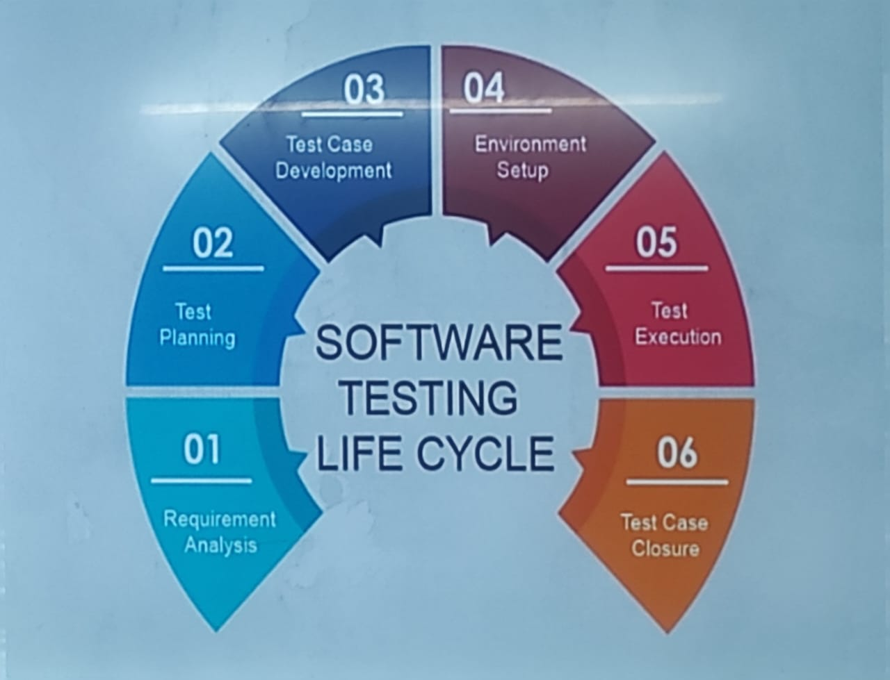
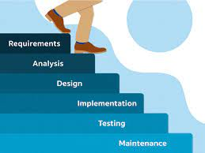
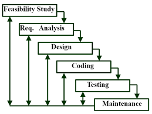
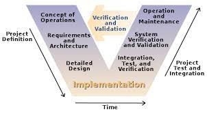

# SET Notes #

## 1.1 Syllabus Discussion ##

- Introduction
- Software Development Life Cycle
- Requirement Analysis
- Software Project Management
- Software Design
- Coding and Testing
- Maintenance
- Quality Management
- Reuse

## 1.2 Introduction ##

*Software Engineering:* It is a systematic, disciplined, cost effective techniques for software development.

## 1.3 Software Development Life Cycle ##

The first phase of the system development lifecycle is *Requirement Analysis.*

### 1.3.1 Requirement Analysis ###

- It is the first step of the `Software Development Life Cycle`
- It involves to gather all the requirements of the software.
- It is the process of gathering and defining service provided by the system.
- It is the process of studying and analyzing the customer's needs and problems, and then designing an appropriate solution.
- It is the process to find out the problems to be overcomed during the development of the software.

### 1.3.2 Test Planning ###

- It is the second step of the `Software Development Life Cycle`
- It involves to plan all the testing activities.
- It is the process of defining the scope and objectives of testing.
- It is the process of gathering all the requirements of the software, may it be financial, technical, or any other.

### 1.3.3 Test Case Development ###

- It is the third step of the `Software Development Life Cycle`
- It involves to develop all the test cases.
- It is the process of defining the testing approach, test scenarios, test cases, and test data.

### 1.3.4 Test Environment Setup ###

- It is the fourth step of the `Software Development Life Cycle`
- It involves to setup all the testing environment.
- It is the process of setting up the hardware, software, and network configurations required for testing.
- It is the process of creating a test environment for the testing team to test the developed software.

### 1.3.5 Test Execution ###

- It is the fifth step of the `Software Development Life Cycle`
- It involves to execute all the test cases.
- It is the process of executing the code and comparing the expected and actual results.
- It is the process of executing the test cases and reporting defects.

### 1.3.6 Test Cycle Closure ###

- It is the sixth step of the `Software Development Life Cycle`.
- It involves to close all the test cycles.
- It is the process of analyzing the test results and evaluating the exit criteria to determine whether the software is ready for release.

## 1.4 Classical Waterfall Model ##

All the phases included in the `Classical Waterfall Model` are:

1. Feasible Study
2. Requirement Analysis and Specifications
3. Design
4. Coding and Unit Testing
5. System Testing and Integration
6. Maintenance

All the phases are executed in a `sequential manner` and in a `top-down approach`.

**Advanteges of Waterfall Model:**

- Base Model
- Simple and Easy
- Small Projects

**Disadvantages of Waterfall Model:**

- No Feedback
- No Experiment
- No Parallelism
- No Risk Management
- 60% efforts in Maintenance

## 1.5 Iterative Waterfall Model ##

All the phases included in the `Iterative Waterfall Model` are:

1. Feasible Study
2. Requirement Analysis and Specifications
3. Design
4. Coding and Unit Testing
5. System Testing and Integration
6. Maintenance

All the phases are executed in a `sequential manner` and in a `top-down approach`, but the diffrence is that in this model if any error is found in any phase then the phase is repeated again.

**Advantges of Iterative Waterfall Model:**

- Base Model
- Simple and Easy
- Small Projects
- Feedback

**Disadvantages of Iterative Waterfall Model:**

- No Experiment
- No Parallelism
- No Intermediate Delivery
- Rigid
- Less Customer Interaction

## 1.6 V Model ##

- It is also known as `Verification and Validation Model`.
- Extension of `Waterfall Model`.
- Testing is associated with every phase of lifecycle.
- Verification phse (Requirement Analysis, System Design, Architechture Design, Module Design)
- Validation phase (Unit Testing, Integration, System, Acceptance Testing)

**Advantages of V Model:**
