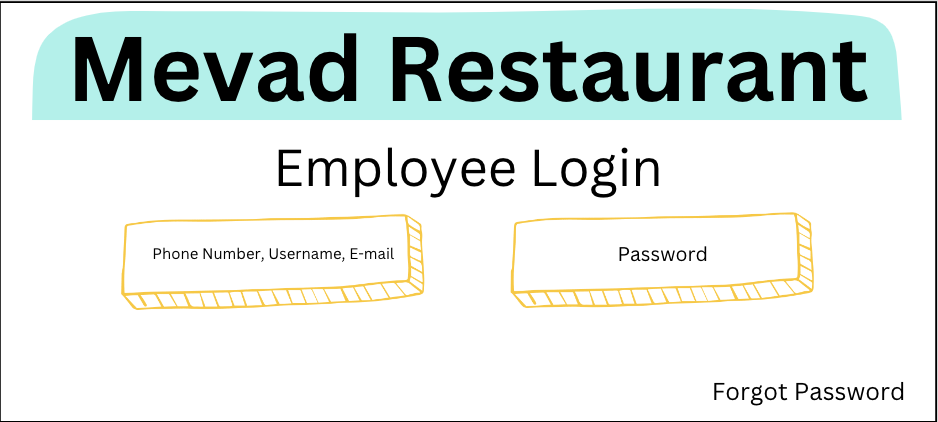

# Restaurant Management System #

## Aim ##

The aim of SRS is to specify the software product in detail. In other words, it contains all necessary and important information that the product team should be aware of in order to create the software.

## Problem Statement ##

The restaurant industry is a fast-paced environment that requires efficient management of resources to ensure timely and quality service. In the traditional restaurant setting, the ordering process, food preparation, and inventory management are carried out manually, leading to errors, delays, and inefficiencies.

## Objective ##

1. Employee Management System:
    - Ability to add/edit/delete employees and assign roles.
    - Login/logout functionality for employees.
2. Menu Management:
    - Ability to add/edit/delete menu items.
    - Option to categorize menu items into sections.
3. Order Management System:
    - Acceptance of orders through POS or online ordering system.
    - Real-time updates on order status.
    - Option to split and merge orders.
4. Inventory Management:
    - Keep track of ingredient levels and generate low stock alerts.
    - Option to import/export inventory data in CSV format.
5. Reports and Analytics:
    - Generate sales reports and analysis of sales trends.
    - Track customer orders and preferences.
6. Customer Management:
    - Option to store customer information and track their order history.
    - Send personalized offers and promotions.
7. Payment Processing:
    - Integration with multiple payment gateways for online and offline payments.
    - Secure storage and processing of sensitive payment information.
8. Security and Access Control:
    - Role-based access control to restrict access to sensitive information.
    - Regular backups to ensure data security.
9. Integration and Scalability:
    - Integration with third-party software and hardware.
    - Option to scale the system as the business grows.

## Interfaces ##

## Data Flow Diagrams for Restaurant Management System ##

 Level 0 DFD 

**Level 1 DFD**

**Level 2 DFD**

## Use Case Diagram for Restaurant Management System ##

## Class Diagram for Restaurant Management System ##

