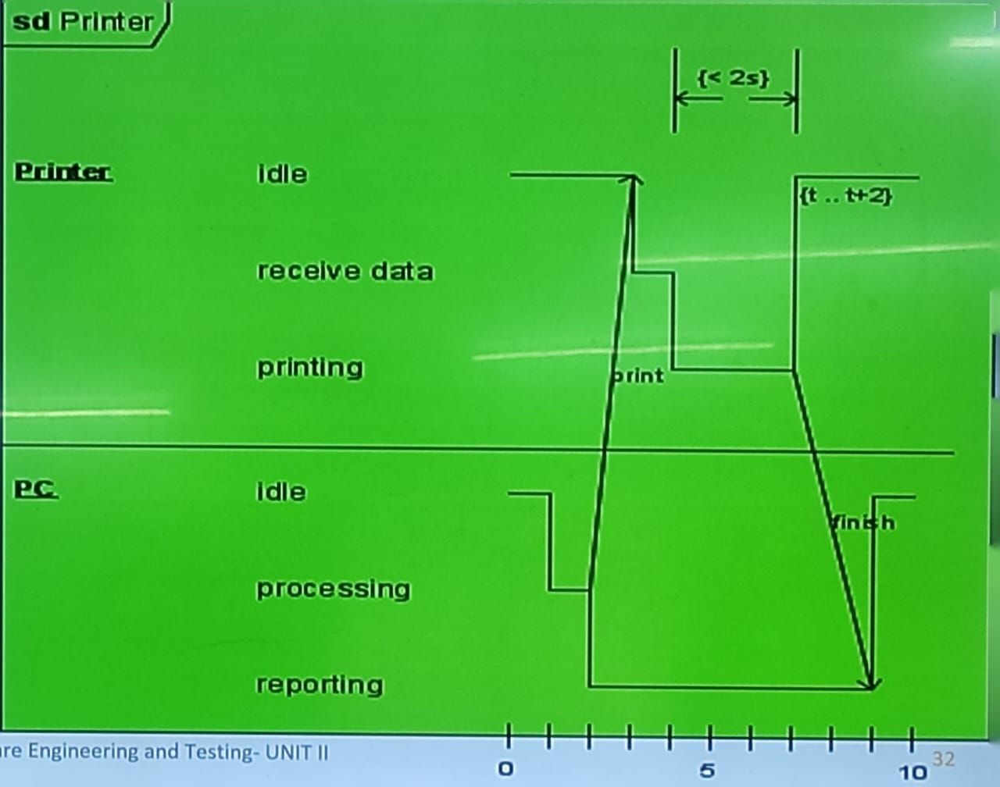
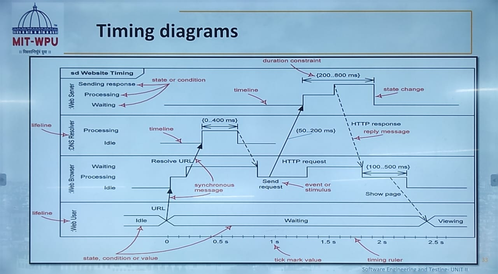

# Unit 2 #

## Functional Modelling ##

- The functional model shows the process that are performed withn an object and how the data changes as it moves between methods it specifies the meaning of the operations of object modelling and the actions of dynamic modelling.
- The process of functional modelling can be vusualized in the following steps:
  
        - Identify all the I/O
        - Construct dta flow diagrams showing functional dependencies

## Unified Modeling Language ##

- UML (Unified Modeling Language) is a modeling language used by software developers.

        - UML
          - an emerging standard for modeling object-oriented software.
          - resulted from the convergence of notations from three leading O-O methods:
            - OMT
            - OOSE
            - Booch

## Object Diagram ##

- An object is shown with a rectangle and the title is underlined.
- Format is:

        - Instance name: Class Name
        - Attributes and Values

## Links ##

- To show how objects work together, links show that two objects can communicate with eachother
- Links must keep to the rules (constraints) given in class diagram.

## Composite Structure Diagrams ##

- A composite structure diagram is a UML structural diagram that contains classes, interfaces, packages, and their relationships, and that provides a logical view of all, or part of a software system.

## Representation of Composite Structure Diagrams ##

- Compostie Structure Diagrams show the internal parts of a class
- Parts are named: partName:partType[multiplicity]
- Aggregated classes are parts of a class but parts are not necessarily classes.
- A part is any element that is used to make up the containing class.

## Interfaces ##

- All interface operations are public and abstract, and do not provide any default implementation.
- All interface attributes must be constants.
- An interace, when standing alone in a diagram, either shown as a class element rectangle with the << interface >> keyword and with its name italicized to denote its abstract, or it is shown as a circle.

## Package Diagrams ##

Two important keywords in package

        - << import >> : one package imports the funtionallity of the other package.
        - << access >> : one package requires help from functions of other package.

## Order Subsystem ##

- Order Processing System - THe problem description: We are going to desing package diagram for "Track Order" scenario for an online store. Track order module is responsible for providing track information.

## UML Sequence Diagram ##

- Sequence diagrams model the dynamic aspects of a sofware system.
- The emphasis is on the 'sequence' of messages rather than relationships bteween objects.
- Dequence digrams provide more detail and show the messages exchanged among a set of objects over time.
- The main purpost of this diagram is to represent the interaction between objects in a system.

Synchronus Message

        - A synchronus message requires a response before the interaction can continue.

Asynchronus Message

        - Asynchronus messages don't need a reply for interaction to continue.

Reply or Return Message

        - A replyy message is drawn with a dotted line and an open arrowhead pointing back to the original lifeline.

Self Message

        - A message an object sends to itself, usually shown as a U shaped arrow pointing back to itself.

They are used during requirement analysis

        - to refine use case dscriptions.
        - to find additional objects('participationg objects')

Messages are represented by arrows

        - The arrowhead indicates the direction of the message.
        - The arrowhead is open if the message is asynchronus.
        - The arrowhead is closed if the message is synchronus.

Activation are represented by narrow rectangles

        - The rectangle is placed on the lifeline of the object that is activated.
        - The rectangle is placed at the point in time when the object is activated.
        - The rectangle is placed at the point in time when the object is deactivated.

Lifelines are represented by dashed arrows

        - The arrow is placed on the lifeline of the object that is activated.
        - The arrow is placed at the point in time when the object is activated.
        - The arrow is placed at the point in time when the object is deactivated.

## Activity Diagrams ##

- It show the structure of a process 
- Supplemnts the use - case by providing a diagrammitic representation of the procedural flow.
- Show flow of control from activity to activity.
- Main Components of activity diagram are:

        - Action 
        - Activity Node
        - Branching 
        - Forking and Joining

- Describes how activites are coordinated. 
- Is particularly useful when you know that an operation ahs to achieve a number of diffrent things, and you want to model what the essential dependencies between them are, before you decide in what order to do them.
- Records the dependecies between activities, such as which things can happen in parallel and what must be finished before someithing else can start.
- Represents the workflow of a process.

## Timing Diagrams ##

- UML 2 Timing Diagrams show the behaviour of the objects in a given period of time. Timing diagram isi a special form os a sequence diagram
- The diffrences between timing diagram and sequence diagram are that the axes are reversed so that the time are increase from left roght and the lifelines are shown separate compartments arranged vertically.
- Timing diagrams focus on conditions changing within and among lifelines along linear time axis.

**Timing Diagram for a Printer:**

- The timing diagram focusing attention on time of accurence of events causing changes in the modeled conditions of the lifelines.

**Timing Diagram for a Website:**

