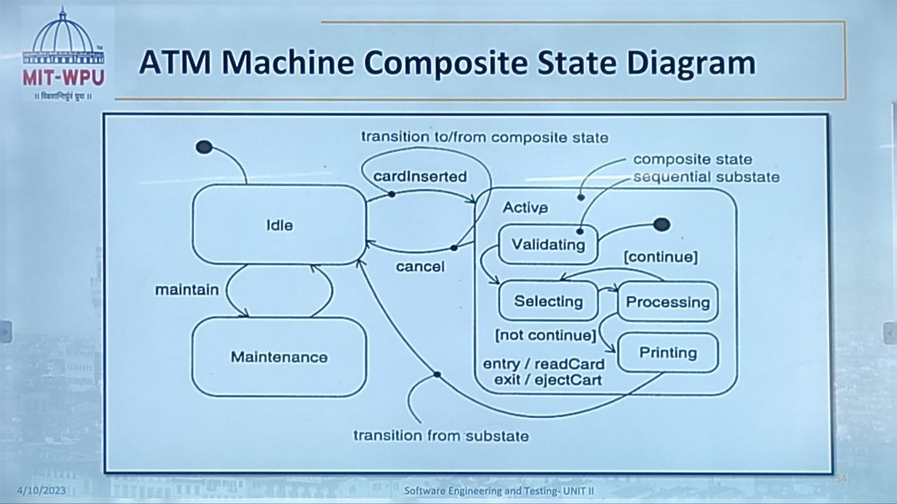
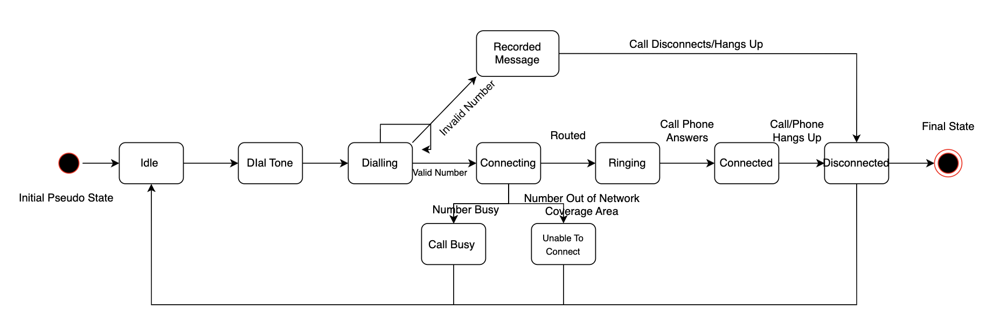
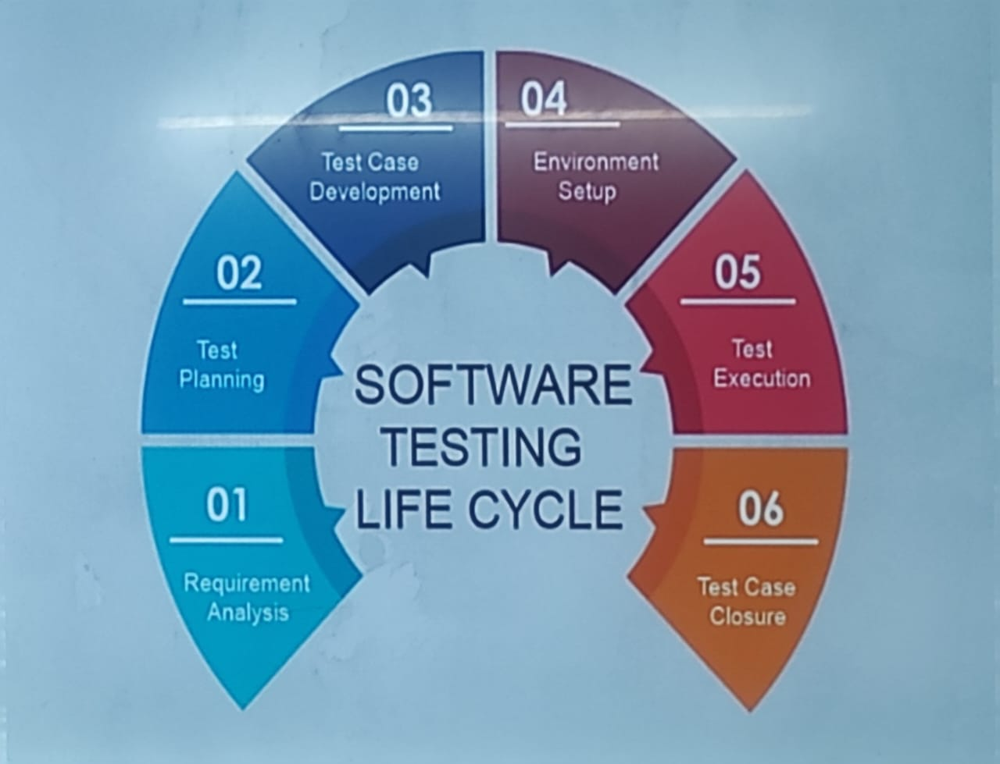
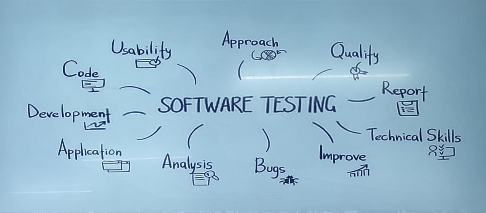

# Unit - 4 #

## Terms and Concepts ##

**Advanced States and Transitions :**

- *Simple State:* A state that contains no sustates.
- *Composite State:* A state that contains one or more substates.
- *Substate:* A state that is contained within a composite state.

**Sequential Substates:**

- A composite state in which the substates are executed in a specific order.
- The substates are executed in the order in which they are listed in the composite state.

**ATM Composite State Diagram:**

**Telephone Communication Composite State Diagram:**

## A little bit of History ##

- Software testing has been prevalent and important evern since piece of software was written in 1940's-50's!
- Earlier methods of software testing mainly involved dibugging and fixing defects.
- Starting 1980s, softwaare developers started looking at the testing activity beyond just fixing defects.
- Starting 1990s, the testing activity started to be looked at as a separate activity from the development activity.

## Why Software Testing? ##

- We all make mistakes' some trivial and some expensive or life-threatining.
- Murphy's first law: if anything can go wrong, it will.
- The primary purpose of software testing is to findout faults and failures from the application before, during and after the installation/deployment.
- Modern software development methodologies such as agile expect the involvement of testers at every step of the way:

    1. user story refinement
    2. design reviews
    3. unit, integration and regression testing during development
    4. final verification before release

## Software Testing Principles ##

- Testing weeds ot defects of diffrent types at diffrent levels.
- Exhaustive Testing is not possible
    1. There is always one more bug!
- Testing may demonstrate ``Defect Clustering``;
    1. Pareto principle: ~80% of the problems oare found in 20% of the modules!
- Pesticide Paradox: Same old test suites and testing techniques will not yield nwe defects. The testes need to be regularly reviewed and revised.
- Absence of errors does not mean the software is usable and useful.
- Early Testing (reight from requirements phase) results in cheaper defect fixes.
- Testing is context dependent.
    1. The approach, methodologies, techniques and types of testing depend on the aplication domain.

## Goals of Software Testing ##

- **Short Term Goals**

    1. To find errors, gaps or missing requirements as compared to actual requirements.
    2. To ensure that the product mathches the performance expectations
    3. TO ensure that the product **IS NOT** doing what it is **not supposed to do!**.
- **Long Term Goals**

    1. Quality
    2. Customer Satisfaction
    3. Risk Management

## Software Testing Process ##

- Software testing is a **constructively destructive** process.
- Testers need to have a methodical, but negative approach to testing.
- Testers need to establish a ``test to break`` attitude for successful testing and delivery of quality products.
- Testing is not only about finding and reporting defects but also about test planning, test execuiton and test coverage of all features.
- In traditional waterfall model, testing is done by independent team of testers either after development is complete or along with the development process.
- Agile development methodologies promote ``test-driven`` software development where unit tests are written even before coding and are continuosly updated maintained by developers.

## Software Testing Life Cycle (STLC) ##

*Like death and taxes, testing is both inevitable and unpleasant - Ed Yourdon*

**What is Involved?**

**Restaurant Management System:**

- Requirement Analysis: The first step in the testing process is to analyze the requirements of the restaurant management system. This involves reviewing the specifications and requirements. Documents to ensure that they are clear, complete, and consistent.

- Test Planning: Based on the requirements analysis, a detailed test plan is created that outlines the testing approach, test scenarios, test cases, and test data. The test plan should also define the testing environment, testing tools, and test schedules.

- Test Case Design: In this phase, the test cases are designed based on the requirements and test plan. The test cases should cover all possible scenarios and be easily understandable and executable.

- Test Environment Setup: The test environment should be set up to mimic the production environment as closely as possible. This includes setting up the hardware, software, and network configurations required for testing.

- Test Execution: The actual testing process begins in this phase. The test cases are executed according to the test plan, and the results are recorded. Any defects or issues discovered during testing are documented and reported to the development team.

- Defect Reporting: When defects are identified, they are documented in a defect tracking tool. The defects are classified, prioritized, and assigned to the development team for resolution.

- Defect Verification: Once the defects are resolved, they are retested to ensure that they have been fixed and do not have any negative impacts on other parts of the system.

- Test Closure: Once all the test cases have been executed, and the defects have been resolved, a test summary report is generated. This report includes the test results, defect reports, and recommendations for further improvements.

*Example of Test Cases:*

| S.No | Feature | Test Case | Input | Output |
|------| ------- | -----------|-------|--------|
| 1 | Login |  Login Button Functionality Working | Click on Login button | Login page should be displayed |
| 2 | Login | Login Buttion Functionality Not Working | Click on Login button | Login page should not be displayed |
| 3 | Sign Up | Sign Up Button Functionality Working | Click on Sign Up button | Sign Up page should be displayed |
| 4 | Sign Up | Sign Up Button Functionality Not Working | Click on Sign Up button | Sign Up page should not be displayed |
| 5 | Login | Login with valid credentials | username: admin, password: admin | Login successful |
| 6 | Login | Login with invalid credentials | username: admin, password: admin123 | Login failed |
| 7 | Login | Login with credential of user without admin privileges | username: user, password: user | Login Successful |
| 8 | Login | Login with credential of user without admin privileges but wrogn password | username: user, password: user123 | Login failed |
| 9 | Login | Login from server of Indian region | username: admin, password: admin | Login successful |
| 10 | Login | Login from server of any other country which is not available in the list | username: admin, password: admin | Login failed |
| 11 | Login | Login from server of Indian region but with wrong password | username: admin, password: admin123 | Login failed |
| 12 | Order Food | Ordering food from menu | Select food from menu | Food will be added to cart |
| 13 | Ordering Food |  Ordering food from menu but with wrong quantity | Select food from menu and enter wrong quantity | Food will not be added to cart |
| 14 | Ordering Food | Ordering food from the menu which is not available temporarily | Select food from menu | Food will not be added to cart |
| 15 | Payment | Processing the payment related to the order | Click on Pay Now button | Payment should be processed successfully |
| 16 | Payment | Processing the payment related to the order but with wrong card details | Click on Pay Now button and enter wrong card details | Payment should not be processed successfully |
| 17 |
